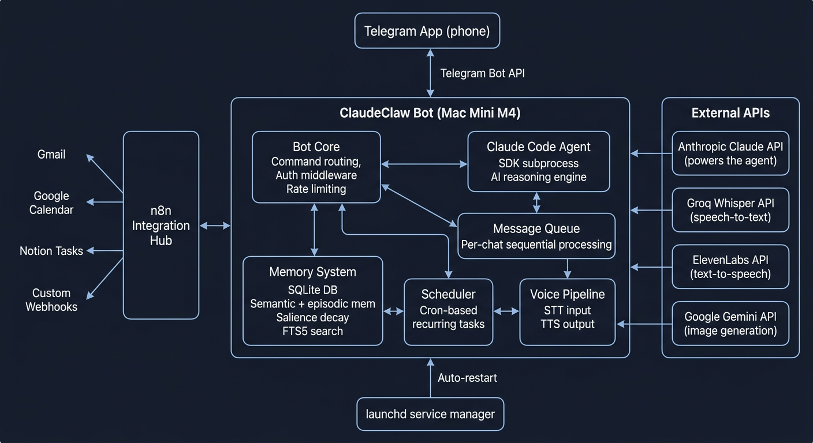

# ClaudeClaw

A Telegram bot that bridges Claude Code to your phone. Send messages, voice notes, photos, and files to your personal AI assistant via Telegram -- powered by Claude Code running on your own machine.

> Inspired by [ClaudeClaw by earlyaidopters](https://github.com/earlyaidopters/claudeclaw). This project was rebuilt from scratch with a different architecture and additional features. The original concept and project name come from their work.

## What it does

- **Telegram as your interface** -- chat with Claude Code from anywhere via your phone
- **Voice support** -- send voice messages, get voice responses back (Groq Whisper + ElevenLabs)
- **Photo & file handling** -- send images and documents for Claude to analyze
- **Message debounce** -- buffers rapid messages (e.g., forward + instruction) and merges them into a single prompt
- **Forward origin tracking** -- forwarded messages include metadata about the original sender/channel
- **Google Workspace MCP** -- direct read/write access to Gmail and Google Calendar via MCP
- **Personal CRM** -- track contacts, interactions, and get pre-meeting briefings
- **n8n integrations** -- connect Gmail, Google Calendar, Notion tasks, or any webhook
- **Scheduled tasks** -- set up cron-based recurring prompts with morning briefings
- **Cross-session memory** -- context persists across conversations via SQLite
- **Session management** -- `/newchat`, `/respin`, `/cancel`, `/cost` commands
- **Bot menu commands** -- all commands registered as Telegram suggestions

## What's different from the original

This project shares the core idea with [earlyaidopters/claudeclaw](https://github.com/earlyaidopters/claudeclaw) -- a Telegram bot that spawns Claude Code on your machine. The codebase was rebuilt from scratch with these additions:

| Feature | This project | Original |
|---------|:---:|:---:|
| Message debounce (merges rapid messages) | Yes | -- |
| Forward origin metadata (channel/user info) | Yes | -- |
| Google Workspace MCP (read/write Gmail + Calendar) | Yes | -- |
| Personal CRM with contact tracking | Yes | -- |
| Morning briefing with CRM-enriched digests | Yes | -- |
| n8n webhook integrations (Gmail, Calendar, Notion) | Yes | -- |
| Telegram bot menu (commands as suggestions) | Yes | -- |
| API cost tracking (`/cost` with daily/weekly/monthly) | Yes | -- |
| Memory with salience decay (semantic + episodic) | Yes | Basic SQLite |
| Full-text search on memories (FTS5) | Yes | -- |
| Per-chat message queue with rate limiting | Yes | -- |
| Context window monitoring (warns at 75%) | Yes | -- |
| Token usage tracking per turn | Yes | -- |
| Comprehensive test suite (148 tests) | Yes | -- |
| SSRF prevention on webhook paths | Yes | -- |
| PID lock (prevents duplicate instances) | Yes | -- |
| Interactive setup wizard (`npm run setup`) | Yes | -- |
| CLI notification script | Yes | -- |
| Self-management (`/restart`, `/rebuild` without LLM) | Yes | -- |
| Multi-model subagent routing (Opus/Sonnet/Haiku) | Yes | -- |
| Image generation via Gemini API (agent skill) | Yes | -- |
| WhatsApp integration | -- | Yes |
| Slack integration | -- | Yes |
| Gemini video analysis | -- | Yes |
| Multiple STT/TTS providers | -- | Yes |

Both projects support: Telegram messaging, voice (STT/TTS), photo/document handling, session persistence, scheduled tasks, and conversation memory.

## Requirements

- Node.js 24+
- [Claude Code CLI](https://docs.anthropic.com/en/docs/claude-code) installed and authenticated
- A Telegram bot token from [@BotFather](https://t.me/BotFather)
- Python 3.11+ with `google-genai` package (for image generation skill, optional)

## Quick Start

```bash
# Clone and install
git clone https://github.com/YOUR_USERNAME/claudeclaw.git
cd claudeclaw
npm install

# Interactive setup (creates .env, optionally configures launchd)
npm run setup

# Or manual setup
cp .env.example .env
# Edit .env with your tokens

# Run
npm run dev
```

## Commands

| Command | Description |
|---------|-------------|
| `/newchat` | Clear session, start fresh |
| `/respin` | New session with recent context loaded |
| `/cancel` | Cancel current request |
| `/status` | Bot status and diagnostics |
| `/cost` | API cost estimates |
| `/voice` | Toggle voice mode on/off |
| `/memory` | Show recent memories |
| `/gmail` | Email summary (requires n8n) |
| `/cal` | Calendar events (requires n8n) |
| `/todo` | Task list (requires n8n) |
| `/n8n <path>` | Call any n8n webhook |
| `/schedule` | Schedule a cron task |
| `/tasks` | List scheduled tasks |
| `/deltask` | Delete a scheduled task |
| `/pausetask` | Pause a scheduled task |
| `/resumetask` | Resume a scheduled task |
| `/restart` | Restart the bot process (no LLM) |
| `/rebuild` | Git pull + npm install + restart (no LLM) |

## Architecture



```
src/
  index.ts        # Entry point, PID lock, startup
  bot.ts          # Telegram bot setup, command routing
  agent.ts        # Claude Code SDK integration
  db.ts           # SQLite schema, conversation log, sessions
  memory.ts       # Cross-session memory with salience decay
  scheduler.ts    # Cron-based task scheduling
  queue.ts        # Per-chat message queue with debounce buffer
  voice.ts        # Groq STT + ElevenLabs TTS
  media.ts        # Photo/file upload handling, forward origin extraction
  config.ts       # Path constants
  env.ts          # Environment variable validation
  logger.ts       # Pino structured logging
  integrations/
    n8n.ts        # n8n webhook client
scripts/
  setup.ts        # Interactive setup wizard
  status.ts       # Health check script
  notify.sh       # Send Telegram messages from CLI
  export-context.sh  # Export conversation context to markdown
.claude/skills/
  generate-image.md     # Image generation skill (Gemini)
  crm.md                # Personal CRM (contacts, interactions, briefings)
  morning-briefing.md   # Daily digest with CRM enrichment
```

## Multi-Model Subagent Routing

The main agent (Opus) automatically delegates routine tasks to a Sonnet subagent to save cost and tokens. No configuration needed -- it works out of the box.

- **Routine tasks** (email, calendar, Q&A, simple edits) -- delegated to Sonnet (~5x cheaper)
- **Complex tasks** (multi-file code, debugging, architecture) -- handled directly by Opus

The main agent decides which model to use based on task complexity. Per-model cost tracking is automatic -- use `/cost` to see the breakdown.

To customize subagent definitions, override via `AGENT_SUBAGENTS` in `.env` (JSON). Set to `{}` to disable routing entirely. See `.env.example` for format.

## Personalizing

Copy `CLAUDE.example.md` to `CLAUDE.md` and fill in the placeholders. This file becomes your assistant's personality and system prompt -- it's loaded into every Claude Code session.

The `.env` file holds your credentials. See `.env.example` for all available options.

## n8n Integration (Optional)

If you run [n8n](https://n8n.io/) on the same machine, ClaudeClaw can call webhooks for Gmail, Calendar, Notion, and any custom workflow. Configure `N8N_BASE_URL` in your `.env`.

## Running as a Service (macOS)

```bash
npm run setup
# Select "yes" when asked about launchd auto-start
```

This creates a launchd plist that keeps the bot running and restarts it on crash.

## Testing

```bash
npm test          # Run all tests
npm run typecheck # TypeScript type checking
```

## Attribution

This project was inspired by [ClaudeClaw by earlyaidopters](https://github.com/earlyaidopters/claudeclaw). The original concept, project name, and initial prompt design come from their work. The codebase has been rebuilt from scratch with a different architecture and additional features listed above.

## License

MIT
